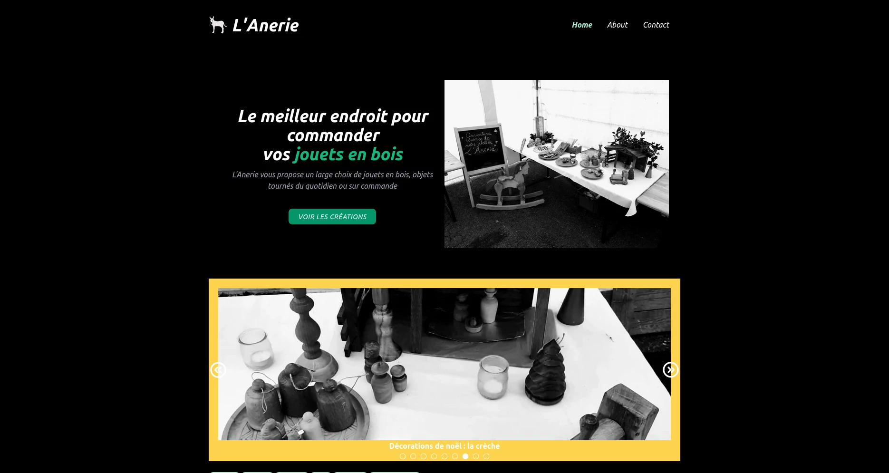

<h1 align="center">
  <br>

<a href="https://menuiserie-joire.deno.dev/"></a>
<br> L'Anerie
<br>

</h1>



<h4 align="center">Un site d'artisan d'objet en bois tournés construit avec <a href="https://deno.com/runtime" target="_blank">Deno</a>.</h4>

<p align="center">
<a href="https://fresh.deno.dev"></a>
</p>

## How To Use

To clone and run this application, you'll need [Git](https://git-scm.com) and
[deno](https://deno.com/runtime) installed on your computer. From your command
line:

```bash
# Install deno
$ curl -fsSL https://deno.land/x/install/install.sh | sh

# Update deno
$ deno upgrade

# Clone this repository
$ git clone git@github.com:swann-martin/lanerie.git

# Go into the repository
$ cd lanerie

# Run the app
$ deno task start
```

## Credits

This software uses the following open source packages:

- [Deno](https://github.com/denoland/deno)
- [Fresh](https://github.com/denoland/fresh)
- [Typescript](https://github.com/microsoft/TypeScript)

## License

Apache-2.0 license

---

> [swannmartin.xyz](https://swannmartin.xyz) &nbsp;&middot;&nbsp; GitHub
> [@swann-martin](https://github.com/swann-martin) &nbsp;&middot;&nbsp; Mastodon
> [@swann](https://fosstodon.org/@swann)
